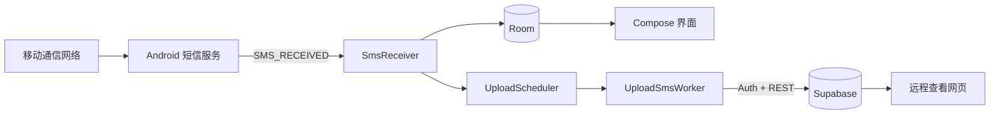

# SmsRelay Android 教学案例

SmsRelay 是一个面向 Android 初学者的完整案例：手机收到新短信后，应用通过系统广播取得短信，先保存到本地 Room 数据库，再由 WorkManager 上传到 Supabase。即使暂时断网，短信也不会因为一次上传失败而丢失。

> 本项目用于学习 Android 广播、运行时权限、本地数据库、后台任务和云端数据同步。短信属于高度敏感数据，请只处理本人设备和本人有权处理的数据。

## 1. 学习目标

完成本案例后，你可以理解：

- 如何在 Manifest 中声明 `BroadcastReceiver`。
- 如何申请 `RECEIVE_SMS` 运行时权限。
- 如何用 Room 实现“单一数据源”和响应式界面。
- 为什么可靠的同步应该“先写本地，再上传云端”。
- 如何用 WorkManager 处理联网约束、退避和失败重试。
- 如何调用 Supabase Auth 与 REST API。
- 如何使用 Android Keystore 加密保存登录令牌。
- 如何用 RLS 保证不同登录用户只能访问自己的数据。
- 如何排查小米 HyperOS 等系统的后台限制。

## 2. 功能概览

- 接收授权后到达的新短信。
- 合并多段短信，并用 SHA-256 指纹去重。
- 将短信离线保存到 Room。
- 使用 Supabase 邮箱密码账号登录。
- 将设备和短信上传至 Supabase。
- 断网后通过 WorkManager 自动补传。
- 在 Compose 界面显示本地短信及上传状态。
- 支持在应用内配置 Project URL 和 Publishable Key。

本应用不需要成为系统默认短信应用，也不会读取安装前的短信收件箱。

### 接收号码设置与升级

1. 已有 Supabase 项目先在 SQL Editor 执行 [recipient 迁移](../supabase/migrations/20260903_add_sms_recipient.sql)，新增可空的 `sms_messages.recipient` 列；不改动原有 RLS。
2. 安装新版 App（正式版升级须使用原来的签名），本地 Room 会从 v1 自动迁移到 v2，保留旧短信和上传队列。不要卸载旧版或清除数据。
3. 点击 App 右上角 **SIM 号码**，按照系统 SIM 管理中的卡槽填写 SIM 1 / SIM 2 的手机号。单卡只填实际使用的卡槽，不使用的卡槽留空。
4. 号码格式为 3–15 位数字，可带 `+` 国际区号，不带空格或横线。此设置无需额外的读取电话号码权限，也不会自动验证号码属于该卡。
5. 新短信按广播中的卡槽匹配号码，并在接收时保存快照。以后修改号码、换卡或补传离线短信都不会改变旧记录的 `recipient`。

卡槽使用零基索引（`0` 对应 SIM 1、`1` 对应 SIM 2），优先读取标准 `android.telephony.extra.SLOT_INDEX`，兼容旧 `slot` 字段。卡槽缺失、不支持或号码未填写时保存 `NULL`，不猜测号码。换卡、移动卡槽或切换 eSIM 后须手动更新配置。当前界面支持两个逻辑卡槽。

旧短信接收时没有号码快照，因此升级后仍为空，在 App 和网页显示“未记录”。先迁移云端表再升级 App；若遗漏迁移，含 `recipient` 的上传会失败，但本地短信仍保留，完成迁移后点击“立即同步”补传。

验收建议：分别向两张 SIM 发送测试短信，核对本机与 Supabase 的 `sim_slot` 和 `recipient`；断网接收后改配置再联网，确认补传仍使用接收时的旧号码。网页列表、详情和搜索都支持接收号码。

## 3. 整体架构



核心原则是：

```text
收到短信 → 本地提交成功 → 调度上传 → 云端成功 → 标记已上传
```

不要在 `BroadcastReceiver` 中直接把网络上传当成唯一操作。网络可能断开，系统也只给广播接收器很短的执行时间。

## 4. 项目结构

```text
app/src/main/
├── AndroidManifest.xml                 # 权限、Activity 和短信广播接收器
└── java/com/example/smsrelay/
    ├── MainActivity.kt                 # Compose 应用入口
    ├── SmsRelayApp.kt                  # Application 与手写依赖容器
    ├── data/
    │   ├── ConfigStore.kt              # Supabase 公开配置
    │   ├── DeviceIdentity.kt           # 稳定的本机 UUID
    │   ├── MessageFingerprint.kt       # 短信幂等指纹
    │   ├── local/                       # Room Entity、DAO、Database
    │   ├── remote/SupabaseClient.kt    # Auth、刷新令牌和 REST 上传
    │   └── session/SessionStore.kt     # Keystore 加密会话
    ├── receiver/SmsReceiver.kt         # 接收 SMS_RECEIVED
    ├── worker/                          # WorkManager 调度与上传
    └── ui/main/                         # Compose 界面和 ViewModel
```

## 5. 关键流程

### 5.1 接收短信

系统收到短信后发送 `android.provider.Telephony.SMS_RECEIVED`。`SmsReceiver` 使用 `goAsync()` 延长广播处理窗口，然后在 IO 协程中：

1. 从 Intent 还原一个或多个 `SmsMessage`。
2. 合并多段短信正文。
3. 提取发送方、接收时间、订阅 ID 和 SIM 卡槽。
4. 计算消息指纹。
5. 写入 Room。
6. 调度上传任务。

`SMS_RECEIVED` 属于 Android 后台隐式广播限制的例外，因此可以在 Manifest 中静态声明。但 OEM 系统仍可能加入额外的省电限制。

### 5.1.1 传统 SMS 与网络短信 / 5G 消息

本项目监听的是 Android 系统广播：

```text
android.provider.Telephony.SMS_RECEIVED
```

它对应通过移动通信网络到达的传统 SMS。部分手机短信应用还提供“免费网络短信”“5G 消息”或 RCS 功能，这些消息可能通过互联网或运营商 RCS 服务传输，并由短信应用自己的服务接收。它们不一定进入 Android 的传统 SMS 流程，也不一定产生 `SMS_RECEIVED` 广播，因此 SmsRelay 可能无法捕获。

```text
传统 SMS：运营商 SMS → SMS_RECEIVED → SmsReceiver → Room
网络/RCS：互联网或 RCS 服务 → 厂商短信应用 → 可能没有 SMS_RECEIVED
```

真机测试时，如果系统短信应用能显示消息，但日志中完全没有 `SMS_RECEIVED`，应检查并临时关闭：

- 免费网络短信。
- 5G 消息。
- RCS 聊天功能。
- 手机厂商提供的其他网络消息功能。

关闭后重新发送一条全新的测试消息，使发送端回退到传统 SMS。已经通过 RCS 接收的历史消息不会被 SmsRelay 补读。

### 5.2 去重

短信指纹由以下字段组成：

```text
sender + body + receivedAt + subscriptionId
```

拼接后计算 SHA-256，并作为 Room 主键和云端 `client_message_id`。同一短信重复广播时，Room 的 `OnConflictStrategy.IGNORE` 会忽略第二次插入；云端唯一约束提供第二层保护。

### 5.3 离线优先上传

`UploadSmsWorker` 每次最多读取 50 条未上传记录。上传成功后填写 `uploadedAt`；失败时记录错误并返回 `Result.retry()`。WorkManager 会根据指数退避策略稍后重试。

这种设计的优点是：界面展示的是 Room 中的真实状态，而不是依赖一次网络请求的临时结果。

### 5.4 登录会话

邮箱和密码只用于调用 Supabase Auth。应用不保存密码，只保存访问令牌、刷新令牌和过期时间。会话 JSON 使用 Android Keystore 中生成的 AES-GCM 密钥加密后，再存入 SharedPreferences。

## 6. Supabase 准备

### 6.1 创建普通 Auth 用户

在 Supabase Dashboard 的 Authentication 页面创建邮箱密码用户。Android 应用和远程网页使用同一个普通用户登录。

### 6.2 示例数据表与 RLS

下面是与本项目字段匹配的教学示例。请在新项目的 SQL Editor 中执行；已有项目应先比较结构，不要重复创建。

```sql
create table public.devices (
  id uuid primary key,
  user_id uuid not null default auth.uid() references auth.users(id) on delete cascade,
  name text not null,
  created_at timestamptz not null default now()
);

create table public.sms_messages (
  id bigint generated by default as identity primary key,
  user_id uuid not null default auth.uid() references auth.users(id) on delete cascade,
  device_id uuid not null references public.devices(id) on delete cascade,
  client_message_id text not null,
  sender text not null,
  recipient text,
  body text not null,
  received_at timestamptz not null,
  subscription_id integer,
  sim_slot integer,
  created_at timestamptz not null default now(),
  unique (device_id, client_message_id)
);

alter table public.devices enable row level security;
alter table public.sms_messages enable row level security;

create policy "users read own devices"
on public.devices for select to authenticated
using (user_id = auth.uid());

create policy "users insert own devices"
on public.devices for insert to authenticated
with check (user_id = auth.uid());

create policy "users update own devices"
on public.devices for update to authenticated
using (user_id = auth.uid()) with check (user_id = auth.uid());

create policy "users read own messages"
on public.sms_messages for select to authenticated
using (user_id = auth.uid());

create policy "users insert own messages"
on public.sms_messages for insert to authenticated
with check (
  user_id = auth.uid()
  and exists (
    select 1 from public.devices d
    where d.id = device_id and d.user_id = auth.uid()
  )
);
```

如果远程网页需要自动出现新短信，还要在 Database → Publications 中把 `sms_messages` 加入 `supabase_realtime`。Android 上传本身不依赖 Realtime。

## 7. 配置应用

推荐首次启动时在应用界面填写：

- Supabase Project URL，例如 `https://xxxx.supabase.co`
- Publishable Key，例如 `sb_publishable_...`

也可以复制根目录的 `supabase.properties.example`：

```bash
cp supabase.properties.example supabase.properties
```

然后填写：

```properties
SUPABASE_URL=https://your-project-ref.supabase.co
SUPABASE_PUBLISHABLE_KEY=sb_publishable_your_key
```

`supabase.properties` 已加入 `.gitignore`。Publishable Key 可以放在客户端，但它必须与 RLS 一起使用。绝对不要把 `service_role`、Secret Key、数据库密码或用户密码写进 APK。

## 8. 构建与运行

环境要求：

- Android Studio 或 Android SDK
- JDK 17
- Android 8.0（API 26）及以上真机

运行单元测试并构建调试 APK：

```bash
./gradlew testDebugUnitTest assembleDebug
```

APK 位于：

```text
app/build/outputs/apk/debug/app-debug.apk
```

### 8.1 构建签名 Release APK

发布签名通过环境变量传给 Gradle，避免把密钥路径或密码写入源码：

```bash
SMS_RELAY_STORE_FILE=/absolute/path/sms-relay-release.p12 \
SMS_RELAY_STORE_PASSWORD=your_store_password \
SMS_RELAY_KEY_ALIAS=sms-relay \
SMS_RELAY_KEY_PASSWORD=your_key_password \
./gradlew assembleRelease
```

产物位于 `app/build/outputs/apk/release/app-release.apk`。签名文件必须安全、长期备份；丢失原签名后，已经安装的应用将无法通过新 APK 原位升级。签名文件、密码和 Release APK 都已由仓库 `.gitignore` 排除，安装包应通过 GitHub Releases 等发布渠道分发。

首次测试步骤：

1. 安装并启动应用。
2. 授予“短信”权限。
3. 填写 Supabase 公开配置。
4. 使用普通 Auth 用户登录。
5. 从另一部手机发送一条全新的短信。
6. 检查本地列表和上传状态。
7. 在 Supabase `sms_messages` 表中确认新增记录。

## 9. 真机调试

检查设备与权限：

```bash
adb devices -l
adb shell dumpsys package com.example.smsrelay
adb shell cmd appops get com.example.smsrelay
```

查看相关日志：

```bash
adb logcat -v time | grep -E "SMS_RECEIVED|SmsReceiver|UploadSmsWorker|Greezer"
```

查看应用本地数据库需要使用可调试构建和 `run-as`。调试时只输出数量或状态，避免在课堂投屏中泄露真实短信内容。

## 10. 小米 / HyperOS 常见问题

如果系统短信应用已经收到短信，但 SmsRelay 仍显示“尚未收到短信”，请检查：

- 短信设置中的“免费网络短信”“5G 消息”或 RCS 是否已关闭，确保测试消息走传统 SMS 通道。
- 设置 → 应用管理 → 短信中继 → 省电策略 → **无限制**。
- 安全中心或应用设置 → **自启动** → 开启。
- 最近任务中锁定应用，避免被一键清理。
- 短信权限是否仍为允许。

本案例实机排障曾观察到：

```text
Greezer Denial: sending SMS_RECEIVED ... process cached
```

这说明 HyperOS 冻结了缓存进程并拦截广播。将省电策略改为“无限制”后，应用进入用户省电白名单，后续短信成功写入 Room 并上传。

本案例还观察到另一类问题：手机开启“免费网络短信”和“5G 消息”时，部分消息由网络消息通道接管，SmsRelay 收不到标准广播；关闭这些功能后，消息回退为传统 SMS，接收恢复正常。它与省电限制是两个独立故障点：

| 现象 | 更可能的原因 | 诊断信号 |
| --- | --- | --- |
| 系统记录到 SMS，但广播发给应用时被拒绝 | HyperOS 后台冻结 | 日志包含 `Greezer Denial` |
| 短信应用有消息，但系统没有标准 SMS 广播 | 网络短信、5G 消息或 RCS | 日志中没有 `SMS_RECEIVED` |
| Room 有记录但云端没有 | 网络、登录会话或 INSERT RLS | 本机显示“待上传”或上传错误 |

## 11. 安全与隐私

- 只申请完成功能必需的权限。
- 本项目不申请 `READ_SMS`，因此不会扫描历史收件箱。
- 禁用短信数据的系统备份。
- 只允许 HTTPS，不允许明文 HTTP。
- 登录密码不持久化。
- 会话令牌使用 Keystore 加密。
- 云端表必须启用 RLS。
- 前端和 APK 都不能包含 `service_role` Key。
- 课堂演示应使用测试号码和虚构短信。

## 12. 可安排的课程练习

1. 给 `MessageFingerprint` 增加更多边界测试。
2. 在界面中增加“仅显示上传失败”的筛选项。
3. 为 Room 增加版本 2 字段并编写 Migration。
4. 给上传 Worker 增加结构化日志和失败分类。
5. 使用假的 Supabase 客户端编写 ViewModel 单元测试。
6. 比较“直接网络上传”和“离线优先队列”在断网时的差异。

## 13. 已知边界

- 只接收获得权限之后到达的新短信。
- 只监听传统 SMS；网络短信、5G 消息和 RCS 不保证产生 `SMS_RECEIVED`。
- OEM 后台策略可能影响广播及时性。
- 该 MVP 没有读取、删除或回复系统短信。
- 调试 APK 不应用于正式分发；正式版本需要独立包名、签名、隐私政策和完整安全审计。
