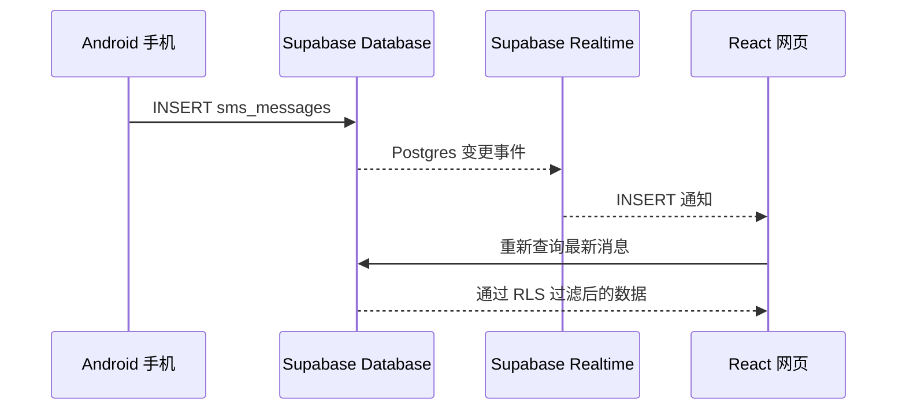

# 短信中继台 Web 教学案例

这是 SmsRelay Android 案例配套的远程查看网页。用户通过 Supabase Auth 登录后，浏览器直接查询 `sms_messages` 和 `devices`，并使用 Supabase Realtime 订阅新短信。项目可部署到 Vercel、EdgeOne 或 Synology Web Station。

线上示例：[https://sms-relay-web-liard.vercel.app](https://sms-relay-web-liard.vercel.app)

> 短信属于敏感数据。教学演示请使用测试号码和虚构内容，并确保 Supabase RLS 已正确启用。

## 1. 学习目标

- 使用 Vite 创建 React 单页应用。
- 理解 React 状态、Effect、Memo 和组件拆分。
- 使用 Supabase JavaScript SDK 完成邮箱密码登录。
- 理解 Publishable Key 与用户 Session 的不同职责。
- 查询 Postgres 数据并在浏览器中搜索、筛选和分组。
- 使用 Realtime 监听 Postgres `INSERT` 事件。
- 实现加载、空数据、错误和实时连接状态。
- 将静态前端部署到 Vercel。

## 2. 功能

- 首次配置 Supabase Project URL 和 Publishable Key。
- Supabase Auth 邮箱密码登录与持久化会话。
- 查询最近 500 条短信。
- 按号码、正文或设备名称搜索。
- 显示并搜索接收号码 `recipient`（由 Android 在收到短信时按 SIM 配置保存）。
- 按 Android 设备筛选。
- 按日本标准时间（JST）分组和显示。
- 实时刷新新增短信。
- 查看详情和复制正文。
- 响应式桌面与手机布局。
- 显示明确的加载、空状态和 RLS 错误提示。

## 3. 数据流



收到 Realtime 通知后，网页没有直接把事件 payload 塞进列表，而是重新查询一次。这样列表、设备映射、排序和 RLS 结果始终来自同一套查询逻辑，代码更容易理解。

Realtime 只负责让网页“自动更新”。即使没有开启 Realtime，手动刷新仍能查询到已经上传的短信。

## 4. 项目结构

```text
SmsRelayWeb/
├── index.html              # Vite HTML 入口
├── package.json            # 依赖与脚本
├── vercel.json             # SPA 路由和安全响应头
├── .env.example            # 构建时公开配置示例
└── src/
    ├── main.jsx            # 挂载 React 根组件
    ├── App.jsx             # 配置、登录、收件箱和 Realtime
    ├── supabase.js         # 配置存储、校验和客户端工厂
    └── styles.css          # 设计系统与响应式布局
```

## 5. 页面状态机

`App` 根据两个条件决定显示哪一个页面：

```text
没有 Supabase 配置 → SetupScreen
已有配置、没有 Session → LoginScreen
已有配置和 Session → Dashboard
```

Supabase SDK 会将 Session 保存在当前浏览器。刷新页面时，`getSession()` 恢复会话，`onAuthStateChange()` 监听登录、刷新令牌和退出事件。

## 6. 环境要求

- Node.js 20 或更高版本
- npm
- 已完成 Android 案例所需的 Supabase 项目
- `devices`、`sms_messages` 表及正确的 RLS 策略

安装依赖：

```bash
npm install
```

启动开发服务器：

```bash
npm run dev
```

浏览器打开终端输出的本地地址。

## 7. Supabase 配置方式

### 方式 A：首次打开时填写

输入 Android 应用使用的同一组：

- Project URL
- Publishable Key

它们只保存在当前浏览器的 `localStorage`。这种方式适合教学和一个部署连接多个 Supabase 项目。

### 方式 B：构建时环境变量

复制示例文件：

```bash
cp .env.example .env.local
```

填写：

```dotenv
VITE_SUPABASE_URL=https://your-project-ref.supabase.co
VITE_SUPABASE_PUBLISHABLE_KEY=sb_publishable_your_key
```

Vite 中以 `VITE_` 开头的变量会进入浏览器构建产物，因此只能放公开配置。不要在这里填写 `service_role`、Secret Key、数据库密码或 Auth 用户密码。

## 8. 开启 Realtime

接收号码功能需先执行 [Supabase 迁移 SQL](../supabase/migrations/20260903_add_sms_recipient.sql)，并在新版 Android App 的 **SIM 号码** 中配置对应卡槽。旧短信、未配置号码或未知卡槽会显示“未记录”。网页兼容旧记录中缺少 `recipient` 的情况，不会根据设备当前配置倒填历史接收号码。

本地 UI 测试：运行 `npm run dev -- --host 127.0.0.1` 后访问 `/tests/recipient-preview.html`。该页面复用实际 Dashboard，使用虚构的双卡、缺失字段和 NULL 记录，不连接 Supabase；可检查接收号码搜索、列表和详情。默认生产构建不会包含此测试页面。

在 Supabase Dashboard 中：

1. 进入 Database → Publications。
2. 打开 `supabase_realtime`。
3. 确认 `sms_messages` 已加入 publication。
4. 确认登录用户拥有该表的 SELECT RLS 权限。

网页订阅代码位于 `Dashboard` 的第二个 `useEffect`：

```js
client
  .channel('smsrelay-web-live')
  .on(
    'postgres_changes',
    { event: 'INSERT', schema: 'public', table: 'sms_messages' },
    () => loadMessages(true),
  )
  .subscribe()
```

右上角“实时连接”只表示 WebSocket channel 已订阅；表没有加入 publication 时，连接可能正常但收不到数据库事件。

## 9. RLS 为什么必不可少

Publishable Key 会随 JavaScript 下载到访问者浏览器，这是正常设计。它只能识别 Supabase 项目，不能代替用户权限。

真正的数据隔离来自：

```text
Publishable Key + 用户 Access Token + Postgres RLS Policy
```

网页查询 `select('*')` 时，Supabase 会根据 Access Token 得到 `auth.uid()`，再由 RLS 过滤行。如果暂时关闭 RLS 来解决报错，就可能让所有访问者读取全部短信，这是不可接受的。

## 10. 生产构建

```bash
npm run build
```

输出目录为 `dist/`。可以本地预览：

```bash
npm run preview
```

## 11. 部署到 Vercel

首次部署：

```bash
npx vercel
```

正式部署：

```bash
npx vercel --prod
```

`vercel.json` 将未知路径重写到 `index.html`，并添加以下安全响应头：

- `X-Content-Type-Options: nosniff`
- `Referrer-Policy: strict-origin-when-cross-origin`
- 禁用摄像头、麦克风和定位权限

如果使用构建时环境变量，应在 Vercel Project Settings → Environment Variables 中配置同名变量，再重新部署。

### 11.1 部署到腾讯云 EdgeOne Makers

EdgeOne Pages 已升级为 EdgeOne Makers。这个项目也可以通过官方 CLI 直接部署，无需购买 Lighthouse 服务器：

```bash
npm install -g edgeone
edgeone login
npm ci
npm run build
edgeone makers deploy dist -n sms-relay -e production -a overseas
```

`overseas` 表示使用中国内地以外的边缘区域，适合主要从日本访问的场景。直接上传模式不会自动连接 GitHub；代码更新后需要重新构建并执行部署命令。如果希望每次推送后自动部署，可以在 Makers 控制台改用 Git 仓库项目。

当前示例部署地址：<https://sms-relay-lxncf4wd.edgeone.dev/>

### 11.2 通过 Synology Web Station 部署静态成品

本项目构建后只有 HTML、CSS 和 JavaScript，可以直接由 Web Station 托管。

1. 在开发电脑的 `web` 目录执行 `npm ci && npm run build`。
2. 在 NAS 的 `web` 共享文件夹中新建 `sms-relay`，把 `dist` 内部的 `index.html` 和 `assets` 上传到该目录。不要再多套一层 `dist` 目录。
3. 给 DSM 内部系统群组 `http` 授予该目录的只读权限。
4. 打开 **Web Station → 网页服务 → 新增 → 静态网站**，文档根目录选择 `web/sms-relay`，HTTP 后端选择 Nginx。
5. 打开 **Web Station → 网页门户 → 新增 → 网页服务门户**，选择刚创建的服务。
6. 局域网测试可选择“基于端口”，例如 HTTP `8081`，然后访问 `http://NAS局域网IP:8081/`。
7. 正式使用可选择“基于名称”，填写独立域名并启用 HTTPS；证书分配在 **控制面板 → 安全性 → 证书 → 设置** 中完成。

Vite 构建的资源地址从站点根路径 `/assets/` 开始，因此应使用独立域名或独立端口访问，不要把项目放到 `http://NAS地址/sms-relay/` 这样的子路径下。首次打开网页时仍需填写 Supabase Project URL 和 Publishable Key。

## 12. 初学者代码导读

### `useState`

保存会变化并影响界面的数据，例如登录 Session、短信列表、搜索词和连接状态。

### `useEffect`

处理 React 渲染之外的副作用。本项目用它恢复 Auth 会话、首次加载数据以及建立/清理 Realtime channel。

### `useMemo`

缓存由现有状态计算出的值，例如 Supabase 客户端、筛选结果和按日期分组的列表。它不是数据库缓存。

### `useCallback`

保持 `loadMessages` 引用稳定，使 Realtime Effect 不会因为每次渲染都得到新函数而反复重建 channel。

## 13. 常见问题

### 页面空白

先打开浏览器开发者工具查看 Console，并确认 JavaScript 和 CSS 资源返回 200。React JSX 使用经典运行时时，包含 JSX 的模块需要导入 `React`；本项目已显式导入，避免生产构建出现 `React is not defined`。

### 登录成功但无法读取短信

通常是 `sms_messages` 或 `devices` 的 SELECT RLS 策略不允许当前 `auth.uid()`。不要改用 `service_role` Key 绕过问题。

### 新短信只能手动刷新后看到

检查 `sms_messages` 是否加入 `supabase_realtime` publication，并观察右上角实时连接状态。

### Android 已显示短信，网页没有

确认 Android 本地记录的上传状态。如果仍为待上传，先检查网络、登录会话和 Supabase INSERT RLS；网页只能显示已经进入 Supabase 的记录。

### Android 本地也没有这条短信

先确认收到的是传统运营商 SMS。手机的“免费网络短信”“5G 消息”或 RCS 可能通过网络通道送达厂商短信应用，而不产生 `SMS_RECEIVED` 广播；这种消息不会进入 Room，自然也不会上传到网页。教学测试时可关闭这些功能，再发送一条全新的普通 SMS。

### 时间为什么与手机不同

案例面向日本访问场景，代码明确使用 `Asia/Tokyo`，不会跟随浏览器所在地变化。

## 14. 安全与隐私检查表

- 只使用 HTTPS Project URL。
- 只使用 Publishable/anon Key。
- 开启 `devices` 和 `sms_messages` 的 RLS。
- 不在源码、环境变量或 Vercel 中保存用户密码。
- 不在日志或课堂截图中展示真实短信。
- 公共电脑使用后退出登录并清除浏览器站点数据。
- 正式产品应增加 CSP、审计日志、账号恢复和更严格的数据保留策略。

## 15. 课程练习

1. 将最多 500 条一次加载改为分页加载。
2. 在 Realtime 回调中实现安全的增量更新，并处理重复事件。
3. 增加按日期范围筛选和未读状态。
4. 使用测试替身为配置校验和筛选函数编写单元测试。
5. 增加 Error Boundary，比较它与普通请求错误状态的区别。
6. 将 JST 改成用户可选时区并保存为浏览器偏好。

## 16. 与 Android 项目的边界

网页不接收移动通信网络短信，也不会让 Android 应用在后台运行。它只负责 Auth、查询和展示云端数据：

```text
Android：接收 → Room → 上传
Supabase：鉴权 → 存储 → RLS → Realtime
Web：登录 → 查询 → 订阅 → 展示
```
